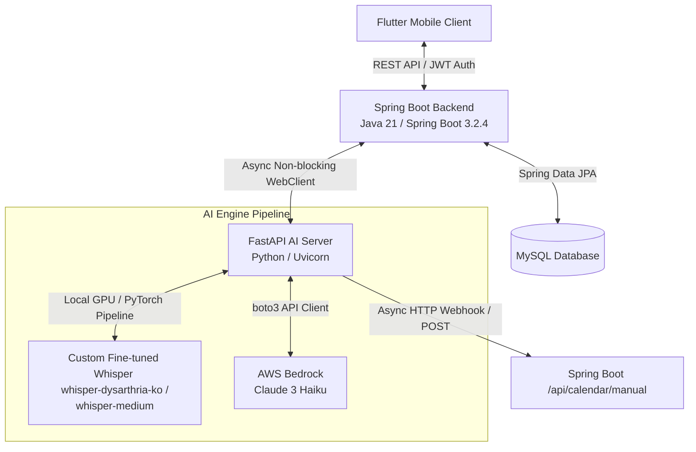
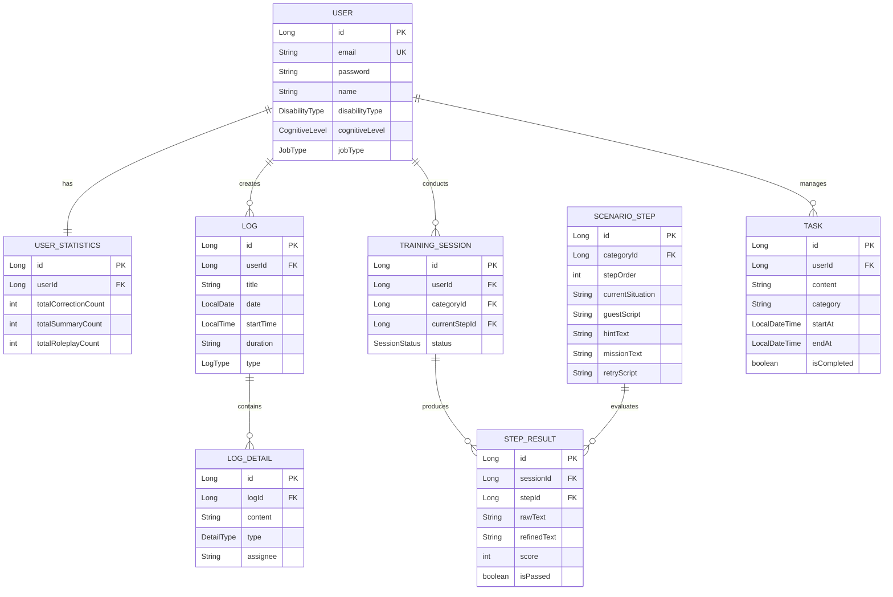

# 🎙️ Malbit (말빛) Backend & AI Server

> "말빛(Malbit)"은 구음장애(Dysarthria) 및 언어 장애가 있는 사용자가 직업 환경이나 일상생활에서 겪는 의사소통적 장벽을 극복하도록 돕는 **AI 기반 어시스턴트 & 발음 개선 훈련 플랫폼**입니다.

이 레포지토리는 사용자의 구어 분석, 맞춤형 발음 피드백(상황극 연습), 단문 리마스터링(발화 보정), 그리고 회의록/업무 내용을 요약하여 캘린더에 연동해 주는 기능을 담당하는 **Spring Boot 백엔드** 및 **FastAPI AI 서버**를 포함하고 있습니다.

---

## 🏗️ 전체 시스템 아키텍처 (Architecture Overview)

대용량 음성 처리 및 대형 언어 모델(LLM) 추론을 안정적이고 반응 속도 저하 없이 수행하기 위해 **Java Spring Boot 기반 비즈니스/보안 서버**와 **Python FastAPI 기반 AI 모델 추론 서버**를 분리하여 설계했습니다.



### 아키텍처 통신 흐름
1. **모바일 클라이언트 (Flutter)**: 오디오 및 사용자 데이터를 REST API 형태로 요청하며 JWT 토큰을 헤더에 실어 전송합니다.
2. **백엔드 서버 (Spring Boot)**: 토큰을 검증하고, 음성 처리가 필요한 복잡한 작업인 경우 `Spring WebFlux WebClient`를 활용하여 FastAPI AI 서버로 오디오 파일을 비동기(Non-blocking Mono) 방식으로 전달합니다.
3. **AI 서버 (FastAPI)**: 전달받은 오디오를 전처리한 뒤, **구음장애(Dysarthria) 파인튜닝 Whisper**에 통과시켜 날것의 텍스트(Raw Text)를 전사합니다.
4. **LLM 오케스트레이터 (AWS Bedrock)**: 전사된 텍스트를 `Claude 3 Haiku` 프롬프트를 사용해 정중하고 완성도 높은 비즈니스용 문장(Refined Text)으로 정제하거나, 업무 회의 분석 데이터(요약, 할 일, 일정)를 추출해 JSON 객체로 파싱합니다.
5. **캘린더 동기화**: AI 분석 과정에서 일정 정보가 추출되면, AI 서버가 즉시 백엔드 서버의 수동 일정 생성 API(`POST /api/calendar/manual`)를 호출하여 해당 사용자의 캘린더에 자동 연동합니다.

---

## 🛠️ 핵심 기술 스택 및 채택 이유 (Tech Stack & Rationale)

### 1. Spring Boot Backend Services (Java)
* **Java 21 & Spring Boot 3.2.4**
  * 대규모 스레드 동시성 상황에서 가상 스레드(Virtual Threads)의 연동성과 최신 JVM 성능 이점을 확보하기 위해 Java 21 LTS 버전 채택.
* **Spring WebFlux WebClient**
  * 음성 전사(ASR) 및 LLM 처리 과정은 필연적으로 5~15초 수준의 높은 지연 시간(Latency)을 유발합니다. 기존 MVC의 `RestTemplate` 같은 동기식 동킹 통신은 대량의 오디오 전송 시 서블릿 스레드 고갈을 초래합니다. 이를 예방하고 극도로 경량화된 비동기 논블로킹 파이프라인을 구축하기 위해 WebClient 채택.
* **Spring Security, OAuth2 Client, JJWT (0.11.5)**
  * 프론트엔드가 크로스 플랫폼 모바일 환경(Flutter)이므로 세션 대신 상태를 유지하지 않는 Stateless 토큰 기반(JWT) 인증 필터를 적용했습니다.
  * 구글, 카카오 등의 소셜 간편 연동을 신속히 구현하기 위해 스프링 표준 OAuth2 클라이언트 통합.
* **Spring Data JPA & MySQL**
  * 객체 지향적 엔티티 설계와 영속성 컨텍스트(1차 캐시, 쓰기 지연)를 극대화하여 트랜잭션 무결성과 효율적인 도메인 모델 관리 보장.

### 2. AI & Speech Engine (Python)
* **FastAPI & Uvicorn**
  * Python 기반의 고성능 비동기 웹 프레임워크로, 멀티파트 오디오 스트리밍 데이터와 AI 추론 루프를 높은 처리량으로 서빙하기 위해 채택.
* **Fine-Tuned ASR Whisper (`openai/whisper-medium` 기반)**
  * 일반적인 상용 STT는 불분명한 조음(Stammering, Dysarthria)을 소음이나 오발음으로 치부하여 인식률이 극도로 떨어집니다. 이를 보완하고자 한국어 구음장애 음성 데이터셋으로 미세 조정된 모델(`tepo6640/whisper-dysarthria-ko`)을 `Transformers Pipeline` 형태로 로드하여 활용합니다.
  * `librosa` 오디오 라이브러리를 통해 모든 입력 음원을 16,000Hz, 모노 채널로 리샘플링하여 추론 오차 최소화.
  * 다중 오디오의 병렬 처리를 위해 `batch_size=8`, `stride_length_s=5`, 그리고 반복적이고 꼬이는 발음에 강인하도록 `repetition_penalty=1.1` 파라미터를 맞춤 구성.
* **AWS Bedrock (Claude 3 Haiku)**
  * Whisper의 전사 텍스트 속 언어적 오류를 극복하고, 정교하고 공손한 문맥을 완성합니다.
  * 가성비와 매우 빠른 응답 시간(Latency)을 보유한 `Claude 3 Haiku` API 모델을 적용하여 일상 및 직업적 발화 분석 기능 구동.

---

## 🔍 기술적 심층 분석 (Deep Dive)

### 1. Spring WebFlux 리액티브 비동기 AI 인터페이스 연동
백엔드와 AI 서버는 완전히 분리되어 있으며 스프링의 WebClient를 사용해 반응형 비동기 단일 엔드포인트를 제공합니다.
```java
// RemasteringService.java 중 일부 발췌
public Mono<RemasteringLogResponse> remaster(String email, MultipartFile audioFile, String preferredTone) {
    long startTime = System.currentTimeMillis();

    MultipartBodyBuilder bodyBuilder = new MultipartBodyBuilder();
    bodyBuilder.part("file", audioFile.getResource());
    if (preferredTone != null && !preferredTone.isBlank()) {
        bodyBuilder.part("preferred_tone", preferredTone);
    }

    return webClient.post()
            .uri("/api/analyze")
            .contentType(MediaType.MULTIPART_FORM_DATA)
            .body(BodyInserters.fromMultipartData(bodyBuilder.build()))
            .retrieve()
            .bodyToMono(AiServerResponseDto.class)
            .map(aiRes -> {
                long latency = System.currentTimeMillis() - startTime;
                String raw = aiRes.getRawText() != null ? aiRes.getRawText() : "인식 내용 없음";
                String refined = aiRes.getRefinedText() != null ? aiRes.getRefinedText() : raw;
                
                // 통계 누적 및 비동기 영속성 컨텍스트 처리
                userService.addCorrection(email, 50);
                ConversationLog savedLog = conversationService.saveResult(email, raw, refined, latency);

                return new RemasteringLogResponse(savedLog.getLogId(), savedLog.getSttOrigin(), savedLog.getRefinedText(), (int) latency);
            });
}
```
* **동작 원리**: 사용자가 전송한 데이터는 스트림 형식으로 AI 서버에 전송되며, 처리 지연 시간이 유지되는 동안 백엔드 프로세스의 스레드는 풀로 반환되어 대기하지 않습니다. 최종 분석 결과를 비동기적으로 받을 때 비로소 매핑 작업과 DB 저장이 트리거되므로 서버 자원의 효율성이 획득됩니다.

### 2. ASR + LLM 다단계 문장 교정 아키텍처
구음장애 아동 및 성인의 대화 특징은 단어 반복, 모음 왜곡, 자음 누락입니다. AI 서버는 이 문제를 해결하기 위해 2단계 파이프라인을 통과시킵니다.
```python
# 1단계: Custom ASR (Whisper)를 통한 음성 전사
raw_text = transcribe_audio(asr_pipe, audio_path)

# 2단계: AWS Bedrock LLM을 통한 Contextual Refinement
# Prompt Engineering을 통해 비논리적 전사를 문맥에 맞는 비즈니스적 구어로 치환합니다.
prompt = f"""
You are the "Malbit Smart Workplace Assistant," specialized in supporting workers with speech or language impairments.
Analyze the [Transcript] below and refine it to clear, polite Korean.
Ensure immediate action items (checklists) and schedules are properly structured.
Reference Date: {current_date}
"""
```
이 2단계 보정 파이프라인은 구음장애 음성인식 정확도의 태생적 불확실성을 LLM 문맥 복원력으로 보정하여 실제 비즈니스 및 소통 현장에서 강력한 실용성을 가지게 해줍니다.

### 3. 다형성(Polymorphic) 업무 분석 및 로그 저장 아키텍처
회의 내용과 장문 발화 데이터 분석 시 대량의 다형성 텍스트를 체계적으로 분류 저장하기 위해 `Log` 엔티티와 상호 연관된 `LogDetail` 엔티티 구조를 적용했습니다.
* **Log**: 전사 세션에 대한 고유 메타데이터(타이틀, 일자, 시작 시간, 상태, 세션 소유주) 관리.
* **LogDetail**: 다형성 타입 필드(`DetailType`)를 활용해 하나의 음성 파일로부터 나온 복합적인 AI 가공 정보를 유연하게 구조화 및 매핑.
  * `SUMMARY`: 회의의 중점 주제 및 AI 단문 요약본.
  * `DECISION`: 회의 중 구두로 확정된 비정기적 합의안 및 체크리스트.
  * `TODO`: 일정(시작일, 마감일, 직무 카테고리)으로 환산될 수 있는 세부적인 실무 목록.

---

## 🗂️ 데이터베이스 ERD (Database Entity Relationship Diagram)



---

## 🔌 주요 API 엔드포인트 명세 (Core APIs)

### 1. 리마스터링 및 회의 분석 API (Async / Non-blocking)
* **POST `/api/remaster`**
  * **설명**: 단문 음성 녹음 파일을 업로드하여 깨끗하고 공손한 문장으로 리마스터링을 수행합니다.
  * **보안**: Bearer JWT 토큰 필수
  * **Form Data**:
    * `audio_file`: MultipartFile (음성 데이터)
    * `preferred_tone`: String (원하는 말투 필터 - 선택)
  * **Response**: `RemasteringLogResponse` (로그 ID, STT 원문, 보정 문장, 소요시간)

* **POST `/api/remaster/analyze-meeting`**
  * **설명**: 장문 회의 녹음을 업로드하여 텍스트 요약, 결정사항, 다가오는 할 일을 추출하고 백엔드 캘린더에 연동합니다.
  * **보안**: Bearer JWT 토큰 필수
  * **Form Data**:
    * `audio_file`: MultipartFile
  * **Response**: `MeetingAnalysisResponse` (로그 ID, 전체 텍스트 원문, 요약, 추출된 체크리스트 배열, 캘린더 연동 일정 배열)

### 2. 발음 훈련 (상황극) API
* **GET `/api/training/categories`**
  * **설명**: 훈련 가능한 직무 상황극(카페, 편의점 등)의 목록을 전체 반환합니다.
* **POST `/api/training/start`**
  * **설명**: 특정 직무 카테고리의 훈련 세션을 초기화하고 시작합니다. (첫 단계 시나리오 대본 반환)
  * **Body**: `{ "categoryId": Long }`
* **POST `/api/training/analyze-voice`**
  * **설명**: 사용자의 실시간 말소리 녹음 파일을 전사 및 분석하여 정답 시나리오 대사와의 유사성을 채점하고, 통과(70점) 시 다음 단계를 동적으로 반환합니다.
  * **Form Data**: `audio_file` (Multipart), `sessionId` (Parameter)
* **POST `/api/training/finish/{sessionId}`**
  * **설명**: 상황극 연습을 정식 종료하고, 진행된 모든 세부 평가 기록과 종합 점수 및 최종 총평을 생성하여 전달합니다.

### 3. 캘린더 및 일정 관리 API
* **POST `/api/calendar/manual`**
  * **설명**: 새로운 일정을 캘린더에 수동으로 직접 등록합니다. (AI 서버에서 파싱된 일정도 이 경로를 통해 동기화됩니다.)
  * **Body**: `{ "content": "string", "category": "string", "start_at": "YYYY-MM-DD HH:MM:SS", "end_at": "YYYY-MM-DD HH:MM:SS" }`
* **GET `/api/calendar`**
  * **설명**: 특정 날짜 기준의 주간/월간 일정을 모두 스캔하여 조회합니다.
  * **Query Param**: `query_date` (예: `2026-05-27`)

---

## ⚙️ 인프라 및 환경 변수 설정 (Configuration Guide)

### 1. Spring Boot 백엔드 설정 (`malbit_backend/.env`)
백엔드 구동에 필수적인 주요 로컬 변수입니다:
```env
DB_URL=jdbc:mysql://localhost:3306/malbit?useSSL=false&allowPublicKeyRetrieval=true&serverTimezone=Asia/Seoul
DB_USERNAME=your_mysql_username
DB_PASSWORD=your_mysql_password

# JWT 암호화 대칭키 설정 (32자 이상의 강도 높은 키)
JWT_SECRET=your_jwt_signature_secret_key_strong_and_unique

# Social OAuth2 Credentials
GOOGLE_CLIENT_ID=your_google_client_id
GOOGLE_CLIENT_SECRET=your_google_client_secret
KAKAO_CLIENT_ID=your_kakao_client_id
KAKAO_CLIENT_SECRET=your_kakao_client_secret

# AI 서버 Endpoint 주소
AI_SERVER_URL=http://localhost:5000
```

### 2. FastAPI AI 서버 설정 (`malbit_backend/malbit_ai/.env`)
```env
# AWS Bedrock access keys for Claude-3-Haiku API invocation
AWS_ACCESS_KEY_ID=your_aws_access_key
AWS_SECRET_ACCESS_KEY=your_aws_secret_key

# 기본 대화 보정 모델 설정
LLM_MODEL=anthropic.claude-3-haiku-20240307-v1:0

# 파인튜닝 Whisper 로드 혹은 standard 가중치 경로
MODEL_PATH=openai/whisper-medium

# Spring Boot 서버 Endpoint
BACKEND_URL=http://localhost:8080
```

---

## 🚀 로컬 빌드 및 배포 방법 (How to Run)

### 필수 인프라 환경
* **Java 21 JDK** 이상
* **Python 3.9** 이상
* **FFmpeg 라이브러리**: 음원의 변환 및 디코딩 연산을 처리하기 위해 OS 환경 변수에 필수적으로 등록되어 있어야 합니다.
  * MacOS: `brew install ffmpeg`
  * Windows: `choco install ffmpeg` 혹은 수동 다운로드 후 Path 추가

### 1. Spring Boot 빌드 & 실행
```bash
cd malbit_backend

# 의존성 빌드 (테스트 실행 패스 옵션)
./gradlew build -x test

# 실행형 Jar 구동
java -jar build/libs/demo-0.0.1-SNAPSHOT.jar
```

### 2. FastAPI AI 서버 실행
```bash
cd malbit_backend/malbit_ai

# 가상환경 격리 및 패키지 설정
python -m venv venv
source venv/Scripts/activate  # Windows: .\venv\Scripts\activate

# 의존 모듈 전체 설치
pip install -r requirements.txt

# FastAPI 서버 5000포트로 실행
uvicorn app:app --host 0.0.0.0 --port 5000 --reload
```

### 3. Docker를 활용한 컨테이너라이징 배포
본 레포지토리 내의 `Dockerfile`들을 기반으로 다중 격리 배포 환경을 생성할 수 있습니다.
```bash
# 1. Spring Boot 백엔드 컨테이너 빌드 & 실행
cd malbit_backend
docker build -t malbit-backend:latest .
docker run -d -p 8080:8080 --env-file .env malbit-backend:latest

# 2. AI 서버 GPU 가속 배포 (GPU 보유 인스턴스 전제)
cd malbit_ai
docker build -t malbit-ai:latest .
docker run -d -p 5000:5000 --gpus all --env-file .env malbit-ai:latest
```
